### Homework
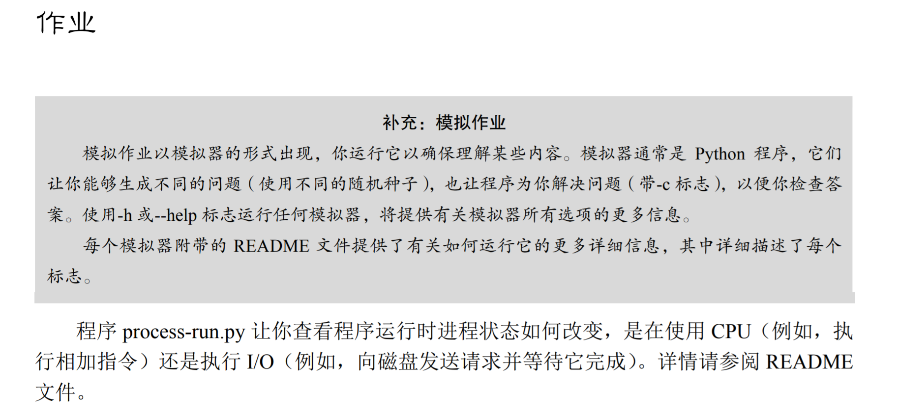

### Questions

1. 用以下标志运行程序：./process-run.py -l 5:100,5:100。CPU 利用率（CPU 使用时间的百分比）应该是多少？为什么你知道这一点？利用 -c 标记查看你的答案是否正确

    python process-run.py -l 5:100,5:100这条指令的真正含义是CPU中有两个进程，分别做5条指令，且这5条指令的CPU占用率都是100%, 所以CPU利用率为100%。

    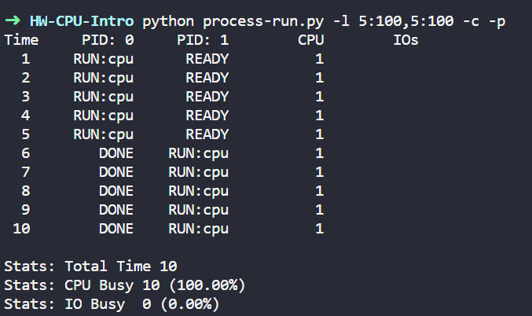

2. 现在用这些标志运行：./process-run.py -l 4:100,1:0。这些标志指定了一个包含 4 条指令的进程（都要使用 CPU），并且只是简单地发出 I/O 并等待它完成。完成这两个进程需要多长时间？利用-c 检查你的答案是否正确。

    运行 python process-run.py -l 4:100,1:0 结果如下:
    
    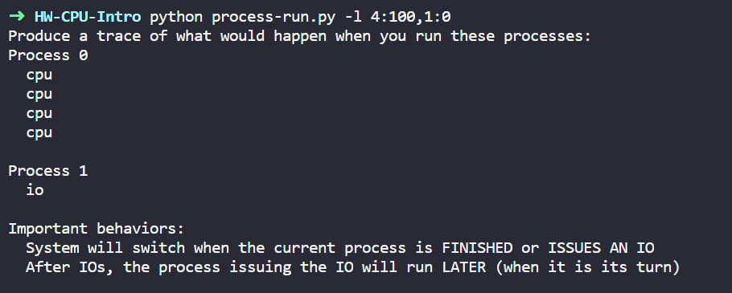

    这里的时间为: pid0 4条指令占用的时间(4) + cpu发起指令开始IO操作, 阻塞该进程(1) + IO的操作时间，此时不使用cpu(n) + IO操作完成，cpu解除pid1的阻塞(1)。
    这个模拟器中IO的操作时间为4(n=4), 所以总时间为10。
    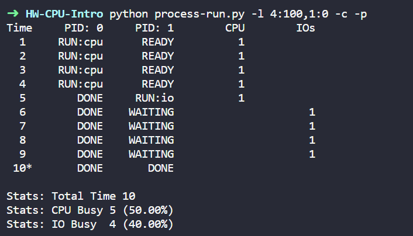

3. 现在交换进程的顺序：./process-run.py -l 1:0,4:100。现在发生了什么？交换顺序是否重要？为什么？同样，用-c 看看你的答案是否正确。
   
    运行 python process-run.py -l 1:0,4:100 结果如下:
    
    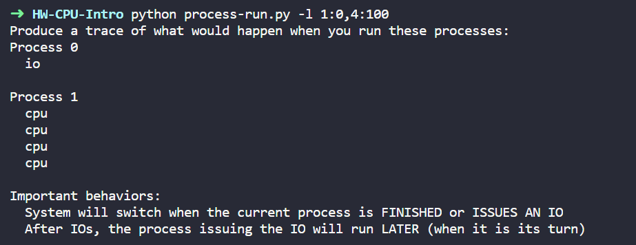

    这时候时间为6：pid0 发起IO, cpu阻塞该进程(1) + pid1 4条指令占用的时间, 这段时间IO恰好完成(4) + pid0 完成IO操作，cpu解除阻塞状态(1)。
    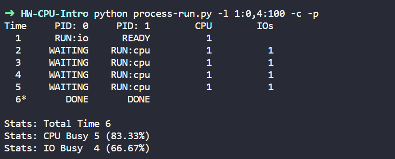

4. 现在探索另一些标志。一个重要的标志是-S，它决定了当进程发出 I/O 时系统如何反应。将标志设置为 SWITCH_ON_END，在进程进行 I/O 操作时，系统将不会切换到另一个进程，而是等待进程完成。当你运行以下两个进程时，会发生什么情况？一个执行 I/O，另一个执行 CPU 工作。（-l 1:0,4:100 -c -S SWITCH_ON_END）

    运行 python process-run.py -l 1:0,4:100 -c -S SWITCH_ON_END 结果如下:
    
    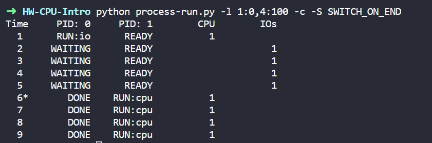

    这里pid0 发起IO时，cpu不阻塞这个进程，等待IO的完成，然后与3类似完成。

5. 现在，运行相同的进程，但切换行为设置，在等待 I/O 时切换到另一个进程（-l 1:0,4:100 -c -S SWITCH_ON_IO）。现在会发生什么？利用-c 来确认你的答案是否正确。

    运行结果如下:
    
    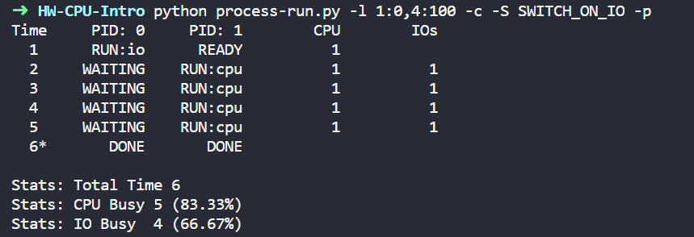

    可以看出结果与3相同，因为这个模拟器默认就是SWITCH_ON_IO的。所以就是运行6个单位时间。

6. 另一个重要的行为是 I/O 完成时要做什么。利用-I IO_RUN_LATER，当 I/O 完成时，发出它的进程不一定马上运行。相反，当时运行的进程一直运行。当你运行这个进程组合时会发生什么？（./process-run.py -l 3:0,5:100,5:100,5:100 -S SWITCH_ON_IO -I IO_RUN_LATER -c -p）系统资源是否被有效利用？
   
    运行结果如下: 
    
    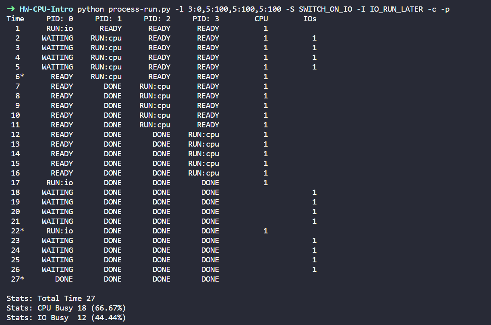

    pid0 运行IO, 等待其他进程完成，然后继续运行。很明显不能有效的利用系统资源。

7. 现在运行相同的进程，但使用-I IO_RUN_IMMEDIATE 设置，该设置立即运行发出 I/O 的进程。这种行为有何不同？为什么运行一个刚刚完成 I/O 的进程会是一个好主意？

    运行结果如下：
    
    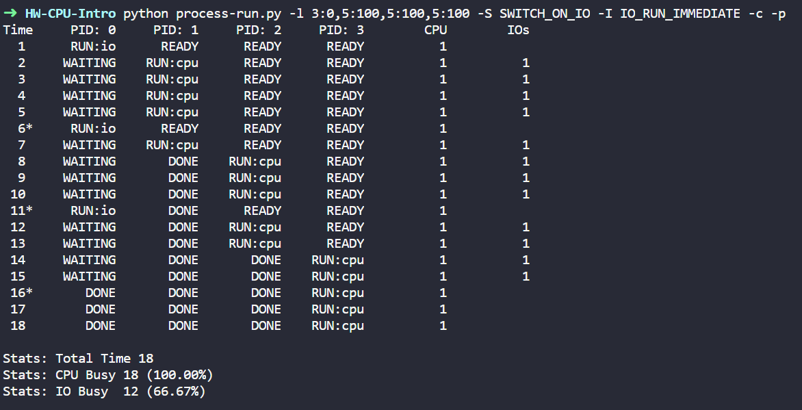

    当pid0 IO等待时，其他程序可以运行。**不知道**

8. 现在运行一些随机生成的进程，例如-s 1 -l 3:50,3:50, -s 2 -l 3:50,3:50, -s 3 -l 3:50,3:50。看看你是否能预测追踪记录会如何变化？当你使用-I IO_RUN_IMMEDIATE 与-I IO_RUN_LATER 时会发生什么？当你使用-S SWITCH_ON_IO 与-S SWITCH_ON_END 时会发生什么？

    运行结果如下: 
    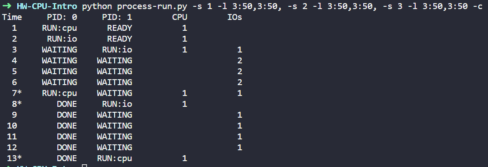

    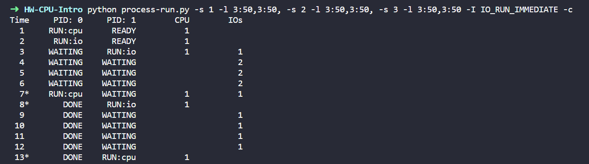

    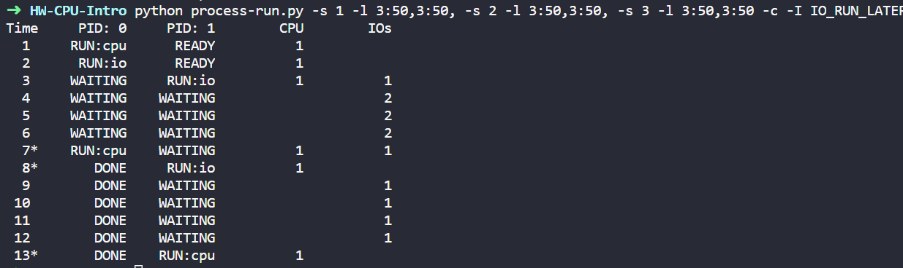

    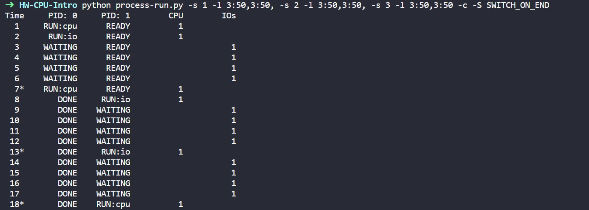

    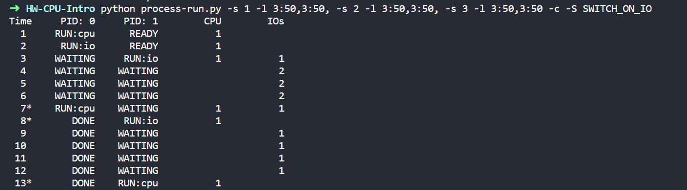
